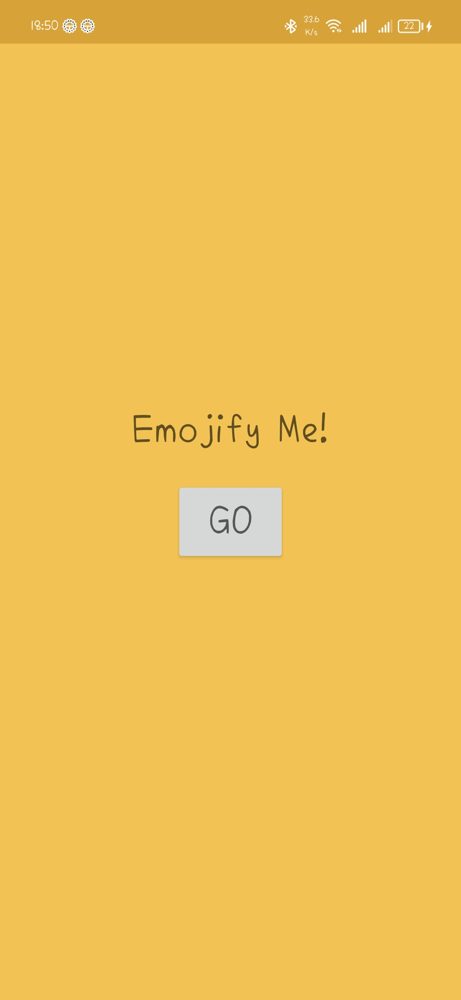
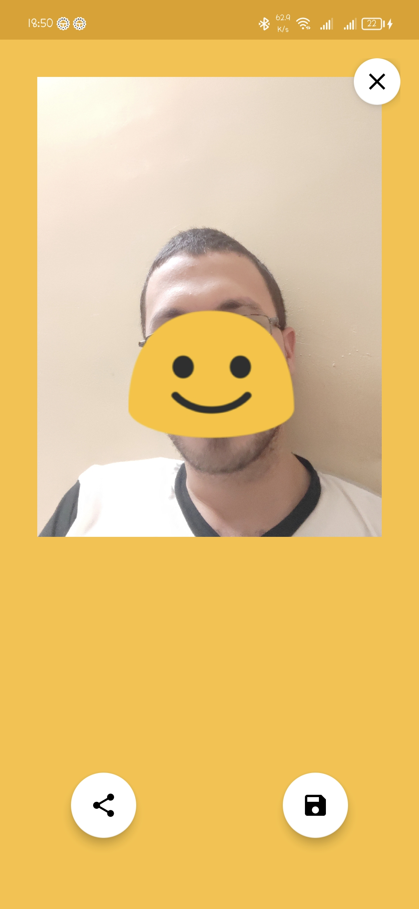

# Emojify
Emojify is a native Android mobile application that uses Java Programming Language to emojify your pictures.

## Application Features:
* Take a picture.
* Emojify it.
* Save it on your device.
* Share it on social media.

## Tools used
* Java
* XML
* Google Mobile Vision Library

## Downloads
[APK Download](https://drive.google.com/file/d/1A1c07lJAKxg9wjguuNLQA2kVpzUz5nbz/view?usp=sharing)

## Screenshots

  
  

